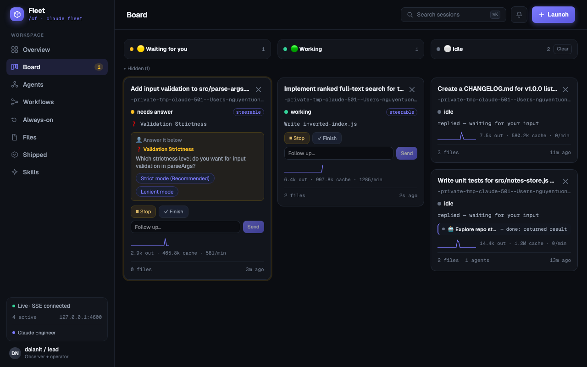
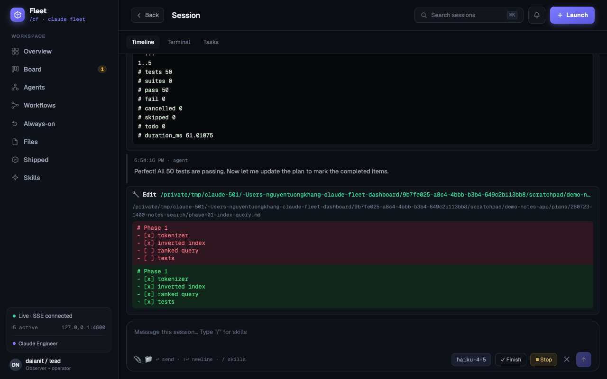
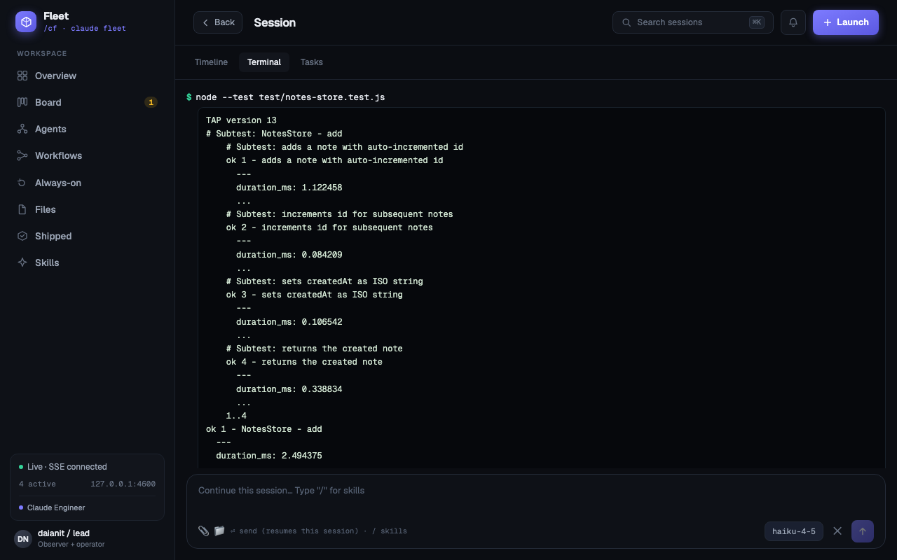
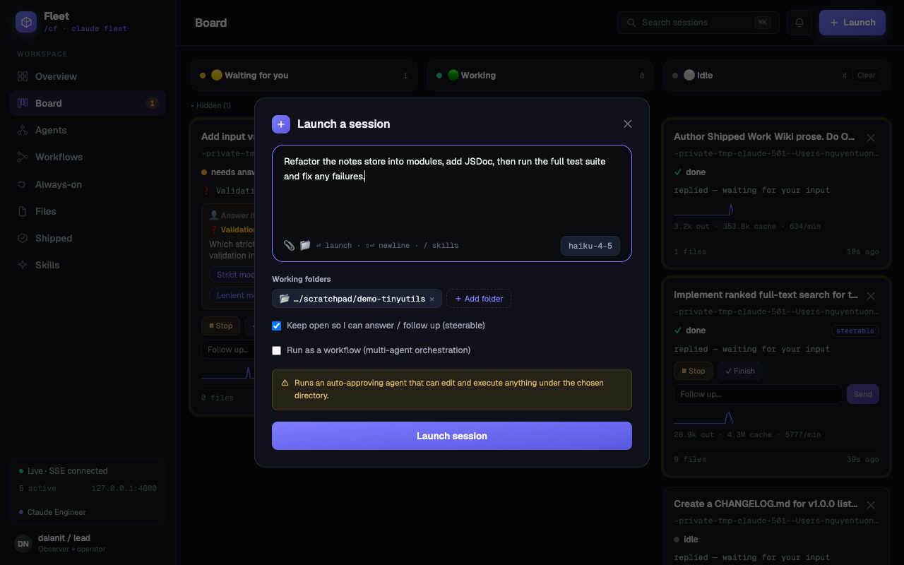
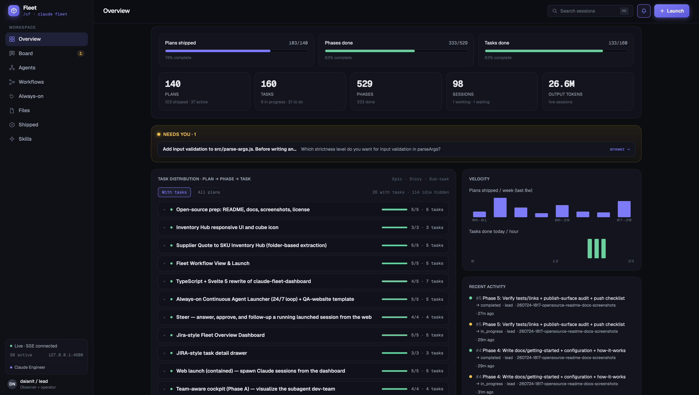
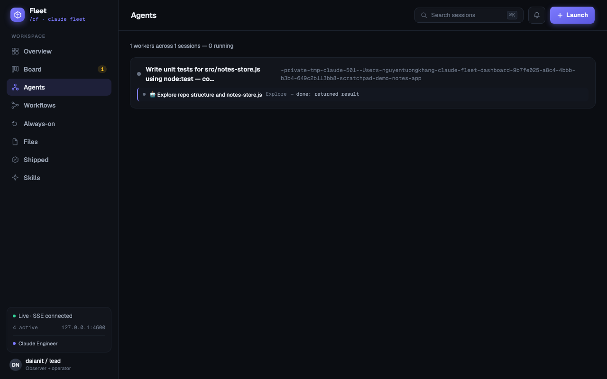
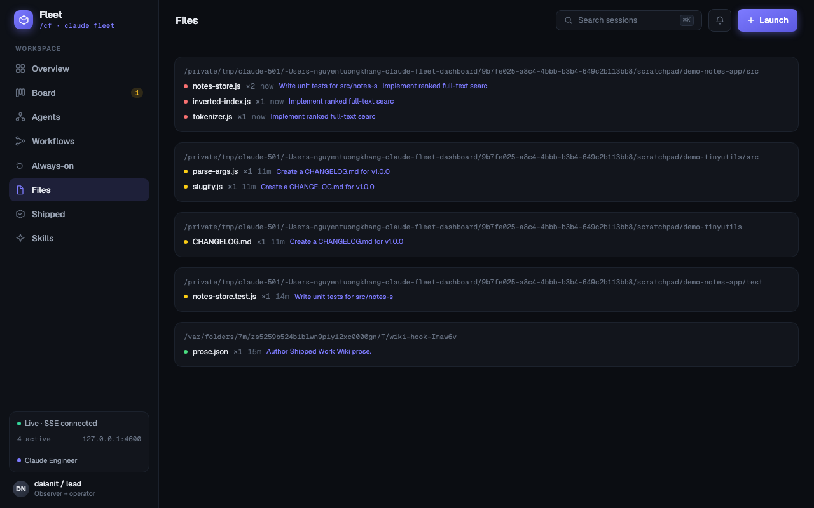

# Claude Fleet Dashboard

Mission control for running many Claude Code sessions at once — built for the **Claude subscription** workflow. No API key, no per-token bill: it watches the transcripts Claude Code already writes on your machine, read-only by default.



## Why

Once you run more than two or three Claude Code sessions in parallel, terminal tabs stop working as a control surface. You can't see who finished, who's still grinding, and — most important — **who is blocked waiting for your answer**.

This dashboard gives you one screen for the whole fleet:

- The session that needs you floats to the leftmost column, **with the actual question and its answer buttons on the card** — answer without opening anything.
- A ding + desktop notification fires the moment any session needs you.
- Every tool call, file edit (as a diff), and shell command of every session — including subagents — is one click away.

## Quick start

Requires Node.js ≥ 20 and [Claude Code](https://claude.com/claude-code) (the dashboard reads its transcripts, so use Claude Code at least once first).

```bash
npm install
npm run build
npm start        # → http://127.0.0.1:4600
```

That's it. It works immediately with zero configuration: the dashboard tails `~/.claude/projects/**/*.jsonl` and every current and future Claude Code session appears live. It binds to localhost only.

## Tour

### Board — who needs you right now

The kanban above is the home for day-to-day work: **🟡 Waiting for you** (leftmost, with the pending question rendered as clickable option chips), **🟢 Working** (current tool action, live token-burn sparkline), **⚪ Idle**. Subagents get their own 🤖 mini-rows on the card.

### Session timeline — every step, verbose



Click a card for the full flow: every tool call auto-expanded, Edit/Write rendered as red/green diffs, Bash output as a colored terminal. Sessions you launched get a chat composer at the bottom — answer questions, steer with follow-ups, or Finish/Stop.

### Terminal view — the fleet's shell log



Every Bash command of the lead *and all subagents* in one scrollback — `$ command` then colored output (ANSI parsed, progress bars collapsed), newest at top.

### Launch sessions from the browser



A desktop-app-style composer: type the task (`/` opens your skill catalog), pick the model from a pill, attach files, and point it at any folder — or several (extra folders become `--add-dir`). Launched sessions are steerable by default: the browser lands on a live session view with a chat box.

**Chat works on every session, not just launched ones** — messaging a finished or externally-started session resumes it in place (`claude --resume`, same transcript), with your model pick applied.

Launching is **disabled by default** — see [Safety](#how-it-works--safety).

### Overview, Agents, Files, Always-on



- **Overview** (`#/`) — fleet-wide progress rollup: plans shipped, phases and tasks done (parsed from `plans/` checkboxes in your projects), a Plan → Phase → Task tree, velocity charts, and a NEEDS-YOU banner.
- **Agents** (`#/agents`) — every subagent worker across the fleet, each deep-linking to its own transcript timeline.



- **Files** (`#/files`) — a heatmap of every file any agent touched, colored by recency, with an in-browser viewer (Markdown rendered, code highlighted).



- **Always-on** (`#/always-on`) — supervised 24/7 agent loops: give a task and a cadence, and a Node supervisor relaunches a fresh headless agent each cycle (with an interval floor, a failure circuit-breaker, and crash-safe recovery). Job mode runs until you stop it; goal mode stops when the agent signals completion.

## Using it effectively

A workflow that works well on a Claude subscription:

1. **Keep the Board open on a second screen** and enable the 🔔 toggle — sound plus desktop notification whenever a session flips to *waiting for you*. The sound works even if OS notifications are denied.
2. **Answer from the card.** `AskUserQuestion` options render as chips right on the board; plan approvals too. You rarely need to open the session.
3. **Opt into launching** by setting `FLEET_ALLOWED_ROOTS` to the directories you're comfortable running auto-approving agents in. This also unlocks resume-chat and always-on loops.
4. **Default to a cheap model** for launches (default is Haiku) and pick bigger models per-launch from the composer pill — big spends stay an explicit choice.
5. **Steer instead of restarting.** Follow-ups go through the card composer or session view; finished sessions resume with full context in the same transcript.
6. **Let old sessions sit.** Idle sessions cost nothing. If the board gets crowded, hide cards (transcripts stay on disk) or set `FLEET_ACTIVE_MINUTES=10080` to auto-hide sessions idle for over a week.
7. **Park recurring chores on Always-on** — e.g. the built-in QA preset that health-checks a URL each cycle and reports findings, detect-only.

## How it works & safety

**Read path (always on):** the server tails `~/.claude/projects/**/*.jsonl` by byte offset and streams state to the SPA over SSE. Nothing is ever written, locked, or renamed under `~/.claude/` — verified by tests. The transcript format is Claude Code's internal business: parsing is defensive, and unknown or corrupt lines render as raw entries instead of crashing.

**Write path (opt-in):** spawning agents is off until you set `FLEET_ALLOWED_ROOTS`. When enabled:

- The server binds `127.0.0.1` only, and every mutation requires a per-run anti-CSRF token plus strict origin/content-type checks — a malicious web page can't reach it.
- Launched processes are capped: model whitelist, turn ceiling, concurrency cap, idle reaper.
- Launched agents run with auto-approved permissions **inside the allowed roots you chose** — only list directories you'd run an agent in yourself.
- A session already active in another writer (your terminal, the desktop app) refuses to resume — two writers would corrupt the transcript.

More detail in [docs/how-it-works.md](docs/how-it-works.md).

## Remote permission approval (opt-in)

Sessions that **opt in** get their *"Allow Bash to run …?"* prompts on the dashboard instead of their own window: the card flips to **Waiting for you** with the exact command and ✅ Allow / ❌ Deny buttons (board, NeedsYouStrip, and session timeline), plus the usual ding + desktop notification. Clicking Allow runs the tool in the original session.

```bash
npm run install-hook     # one-time; backs up ~/.claude/settings.json, npm run uninstall-hook reverts
```

The hook is **strictly opt-in per session** — installed globally but inert unless a session's environment carries `FLEET_REMOTE_APPROVE=on`:

- **Supervised launches opt in automatically:** tick *"🔐 Ask before running tools"* in the Launch dialog — every risky tool call comes back to you as Allow/Deny, and the idle reaper leaves the session alone while it waits.
- **Terminal sessions opt in explicitly:** `FLEET_REMOTE_APPROVE=on claude`
- **Everything else — the desktop app, your everyday terminal sessions — is never touched.** No env marker, no interception, no surprise waits.

How it stays safe:

- **Fail-open, always.** The hook gives up in <300ms if the dashboard isn't running — the session's own prompt appears exactly as before. A dead dashboard can never freeze a session.
- **Auto stays auto.** `bypassPermissions` sessions skip the hook even when opted in.
- **The Allow click is the authority.** Registering a request grants nothing; the answer endpoint sits behind the same anti-CSRF token as launching.

Trade-offs you accept for an opted-in session: while a request waits, the session sits silent in its own window (the dashboard notification is your signal — waits are indefinite by design), and the hook fires before allowlist evaluation, so even allowlisted commands wait for your click.

## Skills catalog

The Skills view and the composer's `/` menu read from a local skill bundle if present (`cf-plugin/` — not included in this repo), otherwise from `~/.claude/skills` and `~/.claude/agents` — so your existing Claude Code skills show up with no setup. See [docs/getting-started.md](docs/getting-started.md#skills-catalog).

## Configuration

Everything is optional — defaults give a working read-only dashboard. The vars you're most likely to touch:

| Var | Default | Meaning |
|-----|---------|---------|
| `FLEET_PORT` | `4600` | HTTP port (always binds `127.0.0.1`) |
| `FLEET_ALLOWED_ROOTS` | *(empty = launching disabled)* | Comma-separated dirs where agents may run |
| `FLEET_LAUNCH_MODEL` | `claude-haiku-4-5-20251001` | Default model for launched sessions |
| `FLEET_MAX_CONCURRENT` | `3` | Max concurrently launched sessions |
| `FLEET_ACTIVE_MINUTES` | `0` (unlimited) | Hide sessions idle longer than this (display-only) |

Full reference: [docs/configuration.md](docs/configuration.md).

## Development

```bash
npm run dev         # Vite HMR (5173) + tsc --watch + node --watch
npm test            # typecheck + build + node:test + vitest
```

Stack: TypeScript Node backend (no framework, one runtime dep — chokidar) + Svelte 5 SPA built with Vite. `npm run build` emits `dist/server/` (tsc) and `dist/client/` (Vite); `npm start` serves both from one origin. Architecture notes: [docs/how-it-works.md](docs/how-it-works.md).

## Not included (by design)

Remote access & auth (localhost only) · token cost analytics · editing source files from the browser · multi-user support.

## License

[MIT](LICENSE)
